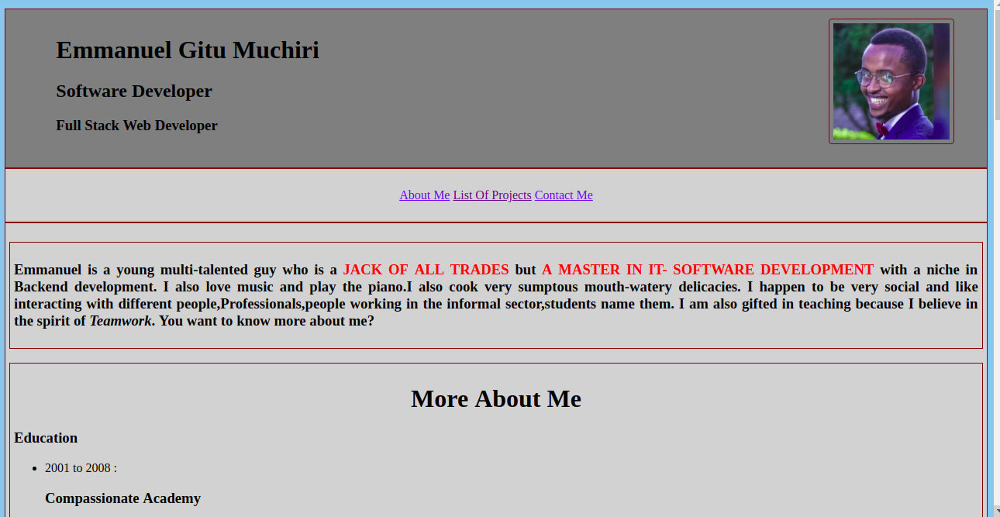
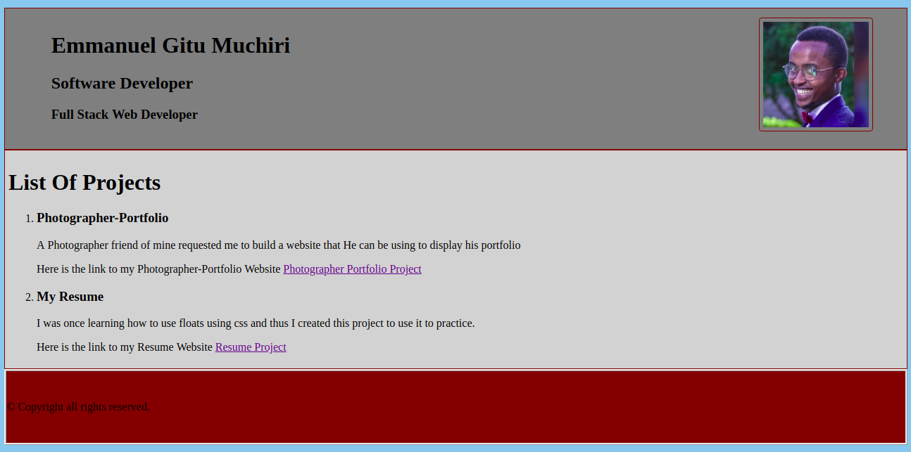

# {Portfolio-Landing-Page}
#### {This application shows you my resume in a nutshell.}, {25 May 2019}
#### By **{Emmanuel Muchiri}**
##Screenshots

## Description
{This application shows you my resume in a nutshell.It contains nearly everything you need to know about me.My photo,my profession,My background as well as my hobbies.It containts a navigation bar that you can use to scroll through.It also has a list of my projects which are live on github site. }
## Setup/Installation Requirements
* Connect to the internet
* Download a web browser of your preference
* click here to open the link : https://emmanuelmuchiri.github.io/portfolio-landing-page/
## Known Bugs
{In case you experience bugs kindly refresh your webpage or restart your web browser }
## Technologies Used
{ 1 .HTML
  2, CSS }
## Support and contact details
{Contact me on my Telephone Number : +254706915605.}
### License
Copyright (c) {year}
